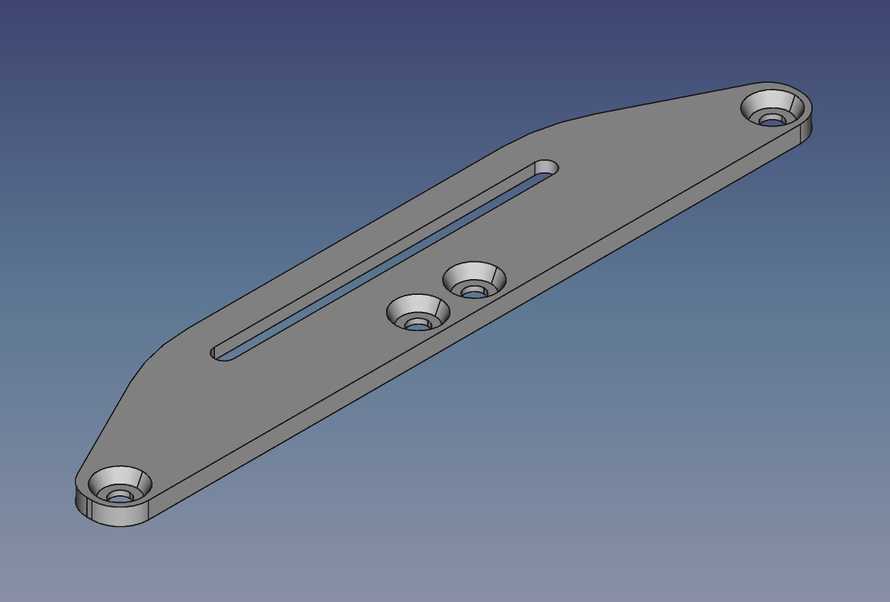
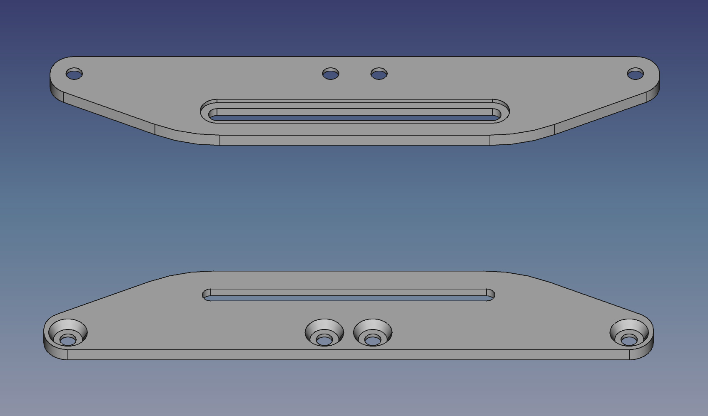
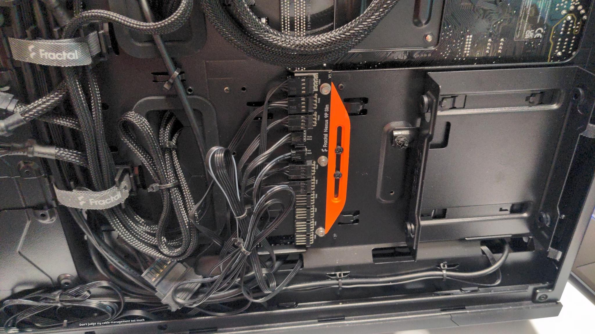
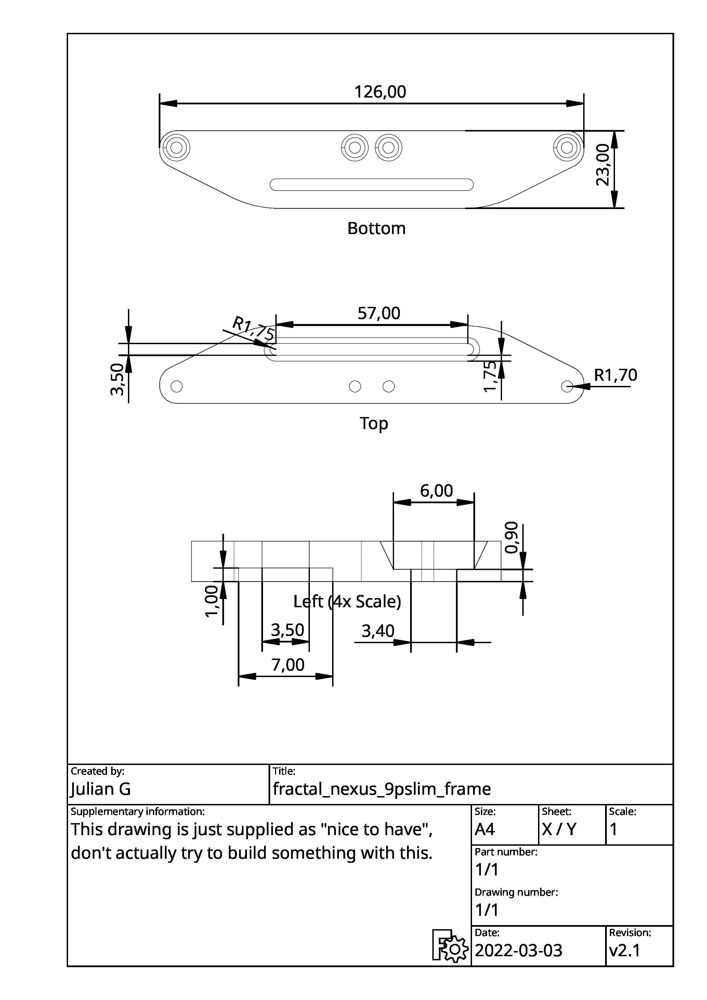

# Mount for the Fractal Design Nexus 9pslim PWM fan hub

|||
|---|---|
|  |  |

I disliked the original position of the little pwm hub in my Fractal Design
torrent since I would have to cramp a lot of cables in the bottom left of the case, so I decided to mount it in the center, where one 3.5" HDD cage used to be.

This is a very simple model, I used three M3 screws+nuts to secure the PCB on
the mount and two of the three screws, that were holding the PCB in its old
home, to fix the mount to two mainboard mounting screw holes.
Note that you can also use this mount on the screw holes where the two 3.5"
cages are secured in. Using the mainboard screw holes let's you keep one of the
cages though.

Make sure that the screws don't extend beyond the nuts to not push the entire
mount against the case.
For detailled measures, look at the
[drawing.jpg](drawing.jpg)/[drawing.pdf](drawing.pdf), at the end of the readme.

## Printing

Note that you will have to use some small supports to print this, no matter
what side you print this on, there are overhangs that can't be printed.
I recommend printing with the spacing for the nuts down (the side that's
labelled “Bottom” in the drawing at the end of the readme).

The support settings in the 3mf file are servicable, not perfect.

## Warning
You might damage your mainboard or other components here if you're not careful!
This 3D model along with any documents or instructions are provided "as is",
without any warranty of any kind.

If you break something, that's on you.

## Licensing

This work is licensed under a
[Creative Commons Attribution-ShareAlike 4.0 International License](http://creativecommons.org/licenses/by-sa/4.0/).
See [LICENSE](./LICENSE).

## Additional Drawing

