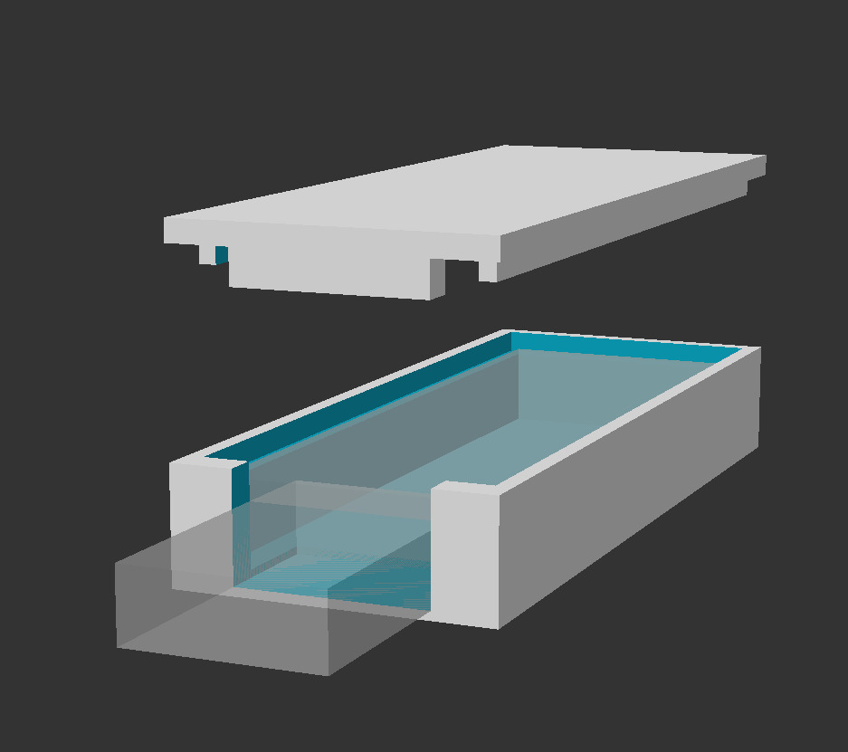
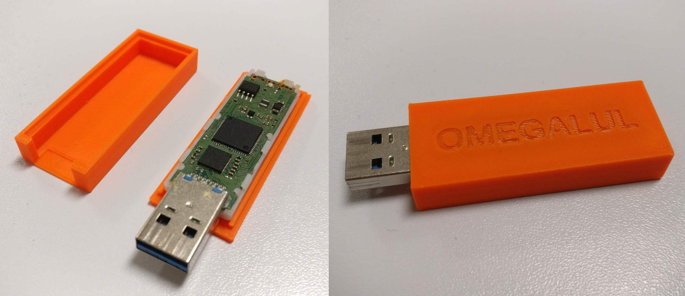

# Configurable USB drive case

I had an old USB drive around with a broken mechanism in the case so I decided to print a new one.

The openSCAD model is very configurable, so you can configure this for your USB drive, or whatever else.

One possible improvement I would like to see is rounded edges for both parts, but from what I've seen it's unnecessarily complex to do that in openSCAD.

## Print settings

I printed this with a Prusa MINI+, using PrusaSlicer 2.3.

Slicer profile: Prusament PLA, 0.15mm QUALITY.

**NOTE:** I recommend generating both the case and the cover into one STL, and using the “Split to object” function in PrusaSlicer.

## Licensing

This work is licensed under a
[Creative Commons Attribution-ShareAlike 4.0 International License](http://creativecommons.org/licenses/by-sa/4.0/).
See [LICENSE](./LICENSE).

